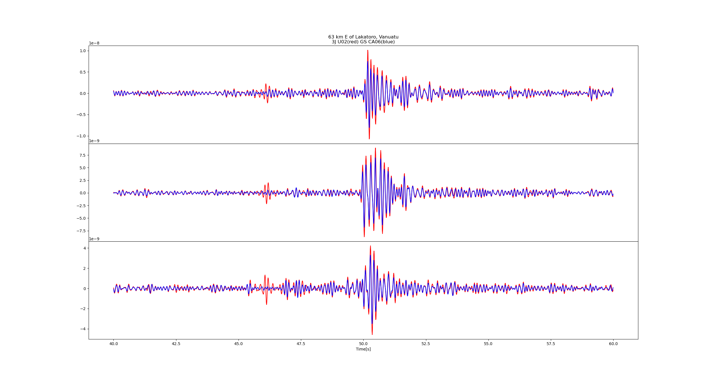
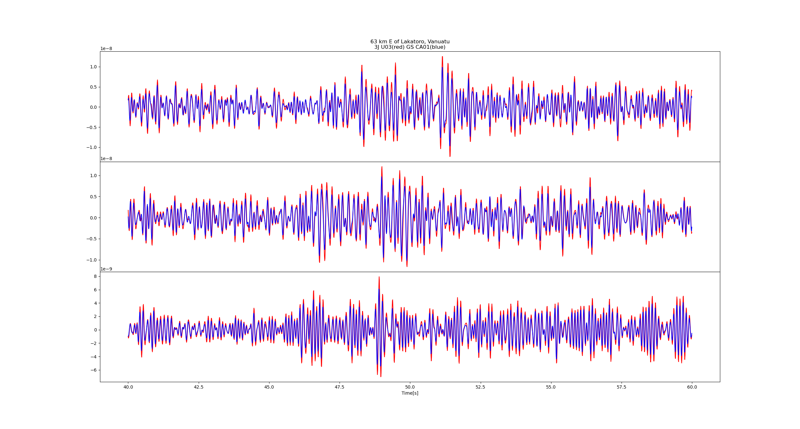

# The SOD learning_example  
### Using the sod to get the 3J U01,3J U02,3J U03,GS CA03,GS CA06,GS CA01 from IRIS and compare the data after removing instrument response
https://github.com/Seis-farmer-inCug/SOD-Example/blob/main/3J%20U01%20GS%20CA03.png
  

